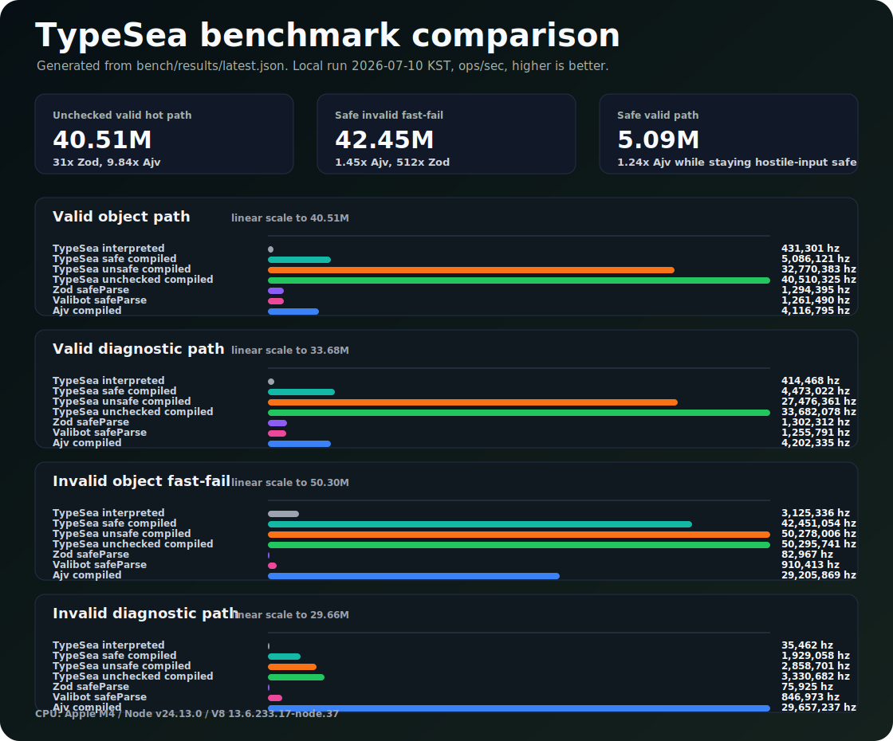

# TypeSea

**TypeSea**는 런타임 의존성 없이 TypeScript 값을 검증하고 타입을 좁히는 라이브러리입니다.
불변 스키마, Sea-of-Nodes에서 영향을 받은 검증 IR, 런타임 컴파일, AOT 소스 생성을 한 흐름으로 묶는 것을 목표로 합니다.

## 기존 코드에서 찍어보기

Zod 4 마이그레이션을 실험할 때는 schema 모양을 유지하고 import만 TypeSea의
facade subpath로 바꿔볼 수 있습니다. 이 facade는 TypeSea guard engine 위의
best-effort 호환 계층이지 Zod parser 내부를 복제한 것이 아닙니다. 먼저 object,
string, number, enum, array, tuple, union, modifier 중심의 일반 schema부터
적용하는 쪽이 현실적입니다.

```ts
// 기존 코드
import { z } from "zod";

// TypeSea 적용
import { z } from "typesea/v4";

const User = z.object({
  id: z.string().uuid(),
  email: z.string().email()
}).strict();

const user = User.parse(input);
```

TypeSea guard는 Standard Schema V1도 노출합니다. 따라서 Standard Schema를 받는
도구에는 guard를 그대로 넘길 수 있습니다. Hono는 `@hono/standard-validator`로
이 경로를 지원하고, tRPC는 Standard Schema validator 또는 TypeSea의 명시적
parser adapter를 사용할 수 있습니다.

```ts
import { sValidator } from "@hono/standard-validator";
import { compile, t, toTrpcParser } from "typesea";

const User = t.strictObject({
  id: t.string.uuid(),
  email: t.string.email()
});

// Hono: Standard Schema 경로라서 TypeSea 전용 adapter가 필요 없습니다.
app.post("/users", sValidator("json", User), (c) => {
  const body = c.req.valid("json");
  return c.json(body);
});

// tRPC: 시작 시 한 번 compile한 뒤 hot path에서 generated predicate를 재사용합니다.
const FastUser = compile(User);
const userInput = toTrpcParser(FastUser);

publicProcedure.input(userInput).mutation(({ input }) => {
  return createUser(input);
});
```

## 벤치마크 요약

마지막 clean 로컬 벤치마크는 2026-07-06 KST에 실행했습니다.
명령은 `npm run bench:record`이며, strict object 계약을 대상으로 한 단일 머신의 초당 실행 횟수입니다.
그래프는 [`bench/results/latest.json`](../../bench/results/latest.json)에서 생성합니다.
아래 수치는 회귀를 잡기 위한 로컬 측정값이지, 릴리스 성능 보증값은 아닙니다.



TypeSea의 안전 모드 컴파일 검증기는 getter 실행 방지와 strict extra key 검사 같은 적대적 입력 방어를 유지하면서도 Ajv의 boolean hot path에 가까운 성능을 냅니다.
`unsafe`와 `unchecked` FastMode는 호출자가 이미 입력을 정규화했고 객체 그래프를 신뢰할 수 있을 때 쓰는 성능 우선 경로입니다.
이 모드에서는 직접 필드 로드, 할당을 줄인 strict-key loop, V8이 inline cache를 붙이기 쉬운 코드 형태를 사용합니다.

> 목표는 "대충 유효해 보이면 통과"가 아닙니다.
> TypeSea의 목표는 **런타임 실행, 컴파일 실행, AOT 실행이 같은 판정을 내린다는 사실을 테스트로 고정하는 검증기**입니다.
> 사용자 코드를 실행하지 않고, 예상 가능한 실패에서 예외를 던지지 않으며, 공개 API 경계 밖으로 변경 가능한 내부 상태를 내보내지 않는 것을 기본 원칙으로 둡니다.

> [!IMPORTANT]
> TypeSea는 **적대적인 경계 입력**을 전제로 설계했습니다.
> 속성 읽기는 descriptor를 통하므로 **사용자 getter를 실행하지 않습니다**.
> `__proto__`와 `constructor` key는 null-prototype lookup으로 처리하고, 사용자 regexp는 복제한 뒤 `lastIndex`를 reset하며, 순환 입력도 유한하게 검증합니다.
> 예상 가능한 실패는 동결된 `Result`로 반환합니다.
> 불명확한 타입 탈출과 암묵적 예외 흐름에 기대지 않도록 코드베이스 전체에 정책 게이트를 둡니다.

> [!WARNING]
> `unsafe`와 `unchecked`는 **public boundary용 모드가 아닙니다**.
> 이미 신뢰 가능한 plain data로 정규화된 입력에서만 사용하세요.
> 이 모드에서는 getter 실행, prototype-backed value 수용, 더 약한 strict extra-key 보장을 호출자가 받아들이는 것입니다.
> 외부 입력에는 기본 safe mode를 쓰는 것이 TypeSea의 보안 계약입니다.

---

## 왜 만들었나

검증 라이브러리를 실제 경계 입력에 쓰다 보면 다음 조건을 동시에 만족시키기 어렵습니다.

- getter 부작용, prototype pollution key, 위조된 schema object, revoked proxy처럼 검증 자체에 저항하는 입력
- 런타임 계획, 컴파일된 검증기, AOT로 생성한 검증기 사이의 동일한 판정
- `throw` 대신 `Result`로 표현되는 명시적 실패
- 공개 API 경계를 지날 때마다 유지되는 불변성

TypeSea는 아래 원칙에 집중합니다.

- 검증 중 사용자 코드 실행 금지
- 런타임, 컴파일, AOT 실행 경로의 판정 일치를 seeded fuzzer로 검증
- 코드 생성 시 사용자 입력을 소스 문자열에 직접 삽입하지 않기
- `optional`과 `undefinedable`을 분리하는 명시적 key presence 규칙

---

## 핵심 속성

- **런타임 의존성 없음**: runtime, peer, optional, bundled dependency가 없습니다. 릴리스 전에 package policy가 이를 기계적으로 검증합니다.
- **세 실행 경로, 하나의 의미**: `is()`와 `check()`는 cached validation plan을 실행하고, `compile()`은 최적화된 IR에서 런타임 predicate를 생성하며, `emitAotModule()`은 standalone validator source를 만듭니다. 일반 `is()`는 per-node interpreter를 타지 않고 schema-specialized kernel을 사용합니다. sparse array, accessor property, symbol key, non-enumerable extra까지 포함해 parity fuzz test를 돌립니다.
- **동결된 공개 표면**: guard, schema, graph, diagnostic, JSON Schema payload는 공개 API 경계를 넘기 전에 freeze됩니다.
- **손실 없는 export만 허용**: JSON Schema와 AOT export는 TypeSea 계약을 의미 손실 없이 표현할 수 있을 때만 성공합니다. 런타임 전용 계약은 schema를 약화시키지 않고 typed issue를 반환합니다.

> [!NOTE]
> TypeSea는 **ESM-only** 패키지입니다.
> `"type": "module"`만 제공하며 CommonJS build는 없습니다.
> Node.js `>= 20.19`에서는 `default` export condition을 통해 `require(esm)` 로드도 가능합니다.

---

## 빠른 시작

```ts
import { compile, t, toJsonSchema, type Infer } from "typesea";

const User = t.strictObject({
  id: t.string.uuid(),
  email: t.string.email(),
  age: t.number.int().nonnegative(),
  role: t.enum(["admin", "user"]),
  tags: t.array(t.string.min(1)).max(8)
});

type User = Infer<typeof User>;

// 1) Boolean narrowing: 성공 경로에서 진단 객체를 만들지 않습니다.
if (User.is(input)) {
  input.id; // narrowed
}

// 2) Immutable diagnostics: 예상 가능한 실패는 Result로 받습니다.
const checked = User.check(input);
if (!checked.ok) {
  console.log(checked.error); // path가 포함된 동결 issue 목록
}

// 3) Hot path: 검증 코드를 생성합니다.
const FastUser = compile(User, { name: "isUser" });

// 4) Interop: 의미 손실이 없을 때만 JSON Schema로 내보냅니다.
const schema = toJsonSchema(User);
```

`is()`는 할당이 적은 boolean 경로에 씁니다.
호출자가 전체 실패 이유와 path를 필요로 하면 `check()`를 씁니다.
hot rejection path에서 기계가 읽을 첫 번째 실패만 필요하면 `checkFirst()`를 씁니다.
스키마가 안정적이고 호출 빈도가 높다면 `compile()` 또는 `emitAotModule()`을 씁니다.
compiled/AOT `checkFirst()`는 전체 issue list를 만든 뒤 자르지 않고 전용 first-fault collector를 사용합니다.

> [!CAUTION]
> `compile()`은 `new Function`으로 검증기를 생성합니다.
> `unsafe-eval`을 금지하는 Content-Security-Policy 환경에서는 사용할 수 없습니다.
> CSP 제한 환경에서는 `emitAotModule()`로 빌드 시점에 validator source를 생성하세요.

### Mini entry point

번들 크기에 민감한 코드는 함수형 subpath를 사용할 수 있습니다.

```ts
import * as mini from "typesea/mini";

const User = mini.object({
  id: mini.string().uuid(),
  name: mini.optional(
    mini.apply(mini.string(), mini.minLength(1), mini.maxLength(80))
  )
});

type User = mini.Infer<typeof User>;
```

`typesea/mini`는 Zod Mini와 같은 방향의 진입점입니다.
큰 `t`/`z` namespace를 가져오지 않고, top-level 함수 builder를 직접 import합니다.
root package와 같은 불변 guard, decoder, message helper, JSON Schema helper,
Standard Schema helper를 유지하되 root 호환성 barrel은 피합니다.
method chain을 피하고 싶으면 `mini.apply(schema, ...helpers)`를 쓰거나
`mini.minLength(1)(mini.string())`처럼 helper를 직접 호출하세요.
첫 helper 묶음은 길이, size, 숫자 bound, 문자열 pattern, `mini.trim()` 같은
문자열 decode transform을 다룹니다.

### SeaFlow 기호 실행 퍼저

```ts
import { fuzzCases } from "typesea/seaflow";
import { t } from "typesea";

const User = t.strictObject({
  id: t.string.uuid(),
  age: t.number.int().gte(0),
  role: t.enum(["admin", "user"])
});

for (const item of fuzzCases(User, { intensity: "high", maxYields: 64 })) {
  console.log(item.kind, item.valid, item.reason, item.value);
}
```

SeaFlow는 TypeSea schema를 위한 개발/테스트용 퍼저입니다.
불변 schema tree를 거꾸로 해석해서 정상 샘플, 실패 경계값, 보안 지향 payload를 생성합니다.
필수 key 삭제, strict object extra key, `__proto__` key, accessor property,
sparse array, union hybrid 같은 입력을 자동으로 만듭니다.
`typesea/seaflow` subpath로 분리되어 있으므로, production validator hot path는
퍼저를 import하지 않는 한 비용을 내지 않습니다. `maxYields`는 목표 생성 개수가
아니라 최대 상한입니다. 작은 schema는 solver가 가진 유한한 edge case를 모두
방출하면 그보다 적은 개수에서 자연스럽게 끝날 수 있습니다.

### SeaBreeze Arena 추론

```ts
import { createSeaBreeze } from "typesea/seabreeze";

const s = createSeaBreeze({ maxNodes: 64, maxFields: 16 });

const User = s.object({
  id: s.string(),
  age: s.optional(s.number()),
  tags: s.array(s.string())
});

const FastUser = s.compile(User, {
  objectMode: "strict",
  mode: "safe",
  name: "isInferredUser"
});

FastUser.is({ id: "u1", tags: ["jit"] }); // true
```

SeaBreeze는 TypeSea의 arena-backed inference surface입니다. 편의 API인
`createSeaBreeze()`는 검증 hot path 기준 zero-cost abstraction입니다. arena
shape를 만드는 동안에만 할당하고, 결과는 여전히 numeric node id이며,
`compile()`은 저수준 reader API와 같은 직접 predicate source를 방출합니다.
`typesea/seabreeze`로 공개되며 `typesea` root에서는 다시 export하지 않으므로,
일반 validator는 이 비용을 내지 않습니다.

### Cold start, fail-fast, 대형 payload

```ts
import {
  compileAsync,
  compileBoolean,
  compileCached,
  createTypeSeaVitePlugin,
  warmup
} from "typesea";

const FastUser = compileCached("user:v1", () => User, { name: "isUser" });
const BooleanUser = compileBoolean(User, { name: "isUserBoolean" });
const AsyncUsers = compileAsync(t.array(User), {
  name: "isUsersAsync",
  yieldEvery: 4096,
  yieldTimeout: 5
});

warmup([User, { key: "user:v1", guard: User, options: { name: "isUser" } }]);

export default createTypeSeaVitePlugin({
  entries: [{ id: "user:v1", guard: User, options: { name: "isUser" } }],
  transformCompileCached: true
});
```

request handler 안에서 schema를 만들거나 compile하는 실수를 막고 싶다면 `compileCached()`를 씁니다.
caller가 정한 semantic key로 캐시하므로, cold-start 비용을 한 번만 지불하고 의도적으로 재사용할 수 있습니다.
`compile()`도 같은 guard instance에 대한 반복 호출은 캐시하며, development build에서는 같은 callsite에서 codegen이 반복되면 경고합니다.

`warmup()`은 Lambda/serverless module scope나 service startup에서 compiled guard를 미리 채웁니다.
true/false 판정만 필요한 hot path는 diagnostic collector를 아예 만들지 않는 `compileBoolean()`을 씁니다.
수십만 개 원소를 가진 array, record, map, set, object graph가 event loop를 오래 막으면 `compileAsync()` 또는 `isAsync()`로 chunk 사이에서 양보하게 할 수 있습니다.

zero-dependency AOT plugin helper는 Rollup, Vite, esbuild compatible plugin object를 반환합니다.
Vite, Rollup, esbuild는 plugin config에 등록된 entry에 한해 정적 `compileCached("id", ...)` 호출을 `typesea:aot/<id>` virtual module import로 치환할 수 있습니다.

### Unsafe FastMode

```ts
const FastButLooseUser = compile(User, {
  name: "isUserFast",
  mode: "unsafe"
});

const FastTrustedShapeUser = compile(User, {
  name: "isUserTrustedShape",
  mode: "unchecked"
});
```

`compile(..., { mode: "unsafe" })`와 `emitAotModule(..., { mode: "unsafe" })`는 TypeSea가 생성할 수 있는 가장 V8 친화적인 predicate를 방출합니다.
required object field는 direct bracket access로 읽고, array와 tuple은 direct indexed load를 쓰며, discriminant는 descriptor read를 피합니다.
strict-object extra는 allocation-free `for...in` loop로 검사합니다.

기본값은 여전히 `mode: "safe"`입니다.
unsafe mode는 getter를 실행할 수 있고, prototype-backed value를 받아들일 수 있으며, strict object에서 symbol 또는 non-enumerable extra를 거부하지 않습니다.
호출자가 객체 그래프를 소유하고 있거나 입력을 plain data record로 이미 정규화한 경우에만 사용하세요.

`mode: "unchecked"`는 한 단계 더 나아가 object shape을 신뢰하고 strict extra-key loop 자체를 건너뜁니다.
이미 소유한 DTO에서는 가장 빠른 경로지만, strict object가 더 이상 extra key를 거부하지 않습니다.

unsafe와 unchecked mode에서 successful compiled `check()`는 frozen success result 대신 raw `{ ok: true, value }` object를 반환합니다.
실패 진단은 계속 freeze됩니다.
safe mode는 success와 failure 모두 frozen `Result` 계약을 유지합니다.

| 계약 | `safe` | `unsafe` | `unchecked` |
| --- | --- | --- | --- |
| 사용자 getter 실행 방지 | 예 | 아니오 | 아니오 |
| prototype-backed field 거부 | 예 | 아니오 | 아니오 |
| enumerable strict extra 거부 | 예 | 예 | 아니오 |
| symbol/non-enumerable strict extra 거부 | 예 | 아니오 | 아니오 |
| compiled `check()` 성공 Result freeze | 예 | 아니오 | 아니오 |
| 의도한 입력 | 외부 경계 입력 | 신뢰된 정규화 record | 호출자가 소유한 고정 shape DTO |

외부 입력에는 항상 `safe`를 쓰세요.
`unsafe`는 이미 plain record로 정규화한 데이터에만, `unchecked`는 extra-key 거부가 필요 없는 호출자 소유 DTO에만 쓰는 모드입니다.

---

## Key Presence

객체 key 존재 여부는 명시적으로 표현합니다.
서로 다른 wrapper는 서로 다른 계약을 뜻합니다.

| Wrapper | key 생략 허용 | value `undefined` 허용 | 추론 타입 |
| --- | --- | --- | --- |
| `t.optional(inner)` / `guard.optional()` | 허용 | 거부 | `key?: T` |
| `t.exactOptional(inner)` / `z.exactOptional(inner)` | 허용 | 거부, standalone `undefined`도 거부 | `key?: T` |
| `t.undefinedable(inner)` / `guard.undefinedable()` | 거부 | 허용 | `key: T \| undefined` |
| `t.nullable(inner)` / `guard.nullable()` | 해당 없음 | `null` 허용 | `key: T \| null` |
| `t.nullish(inner)` / `guard.nullish()` | 허용 | `null` 허용 | `key?: T \| null` |
| `guard.nonoptional()` / `t.nonoptional(inner)` | 거부 | 거부 | `key: T` |

> [!NOTE]
> presence는 wrapper composition을 지나도 유지됩니다.
> `t.nullable(t.optional(x))`는 여전히 "key가 없어도 된다"는 뜻입니다.
> `exactOptionalPropertyTypes` 아래에서 타입 추론과 런타임 동작은 같은 의미를 가집니다.

`guard.unwrap()`이나 `t.unwrap(guard)`를 쓰면 optional, nullable,
undefinedable, array schema의 내부 guard를 꺼낼 수 있습니다. metadata,
message, brand, readonly, refinement wrapper는 payload schema를 가리지
않도록 건너뜁니다.

---

## 실행 모델

TypeSea는 builder validation과 diagnostic을 위해 public schema tree를 유지합니다.
그 뒤 각 schema identity를 cached validation plan으로 낮춥니다.
plan은 최적화된 Sea-of-Nodes graph와 schema-specialized predicate kernel을 소유합니다.
`Guard.is()`는 per-node interpreter dispatch를 피하려고 kernel을 사용하고, `compile()`과 `emitAotModule()`은 optimized graph에서 predicate를 방출합니다.
`check()`는 먼저 같은 plan으로 판정을 얻고, 실패한 값만 schema-aware diagnostic collector로 replay해서 issue path와 code를 만듭니다.

```text
builder -> frozen schema -> lower -> Sea-of-Nodes IR -> optimize
optimize -> ValidationPlan { graph, schema kernel }
schema kernel -> Guard.is() / check() preflight
graph -> compile() predicate / emitAotModule() predicate / Guard.graph()
failed check() -> schema-aware diagnostic collector
```

> [!IMPORTANT]
> generated validator는 **사용자가 제어하는 값을 소스 문자열에 넣지 않습니다**.
> literal, regexp, object key, keyset, dynamic schema fallback은 numeric index로 참조되는 **side table**에 둡니다.
> 적대적인 property name이 generated code 밖으로 탈출할 수 없으며, dedicated injection-audit test가 이 속성을 고정합니다.

---

## 성능 스냅샷

마지막 clean 로컬 벤치마크는 2026-07-06 KST에 실행했습니다.
`npm run bench:record`로 전체 Vitest 벤치를 3회 실행한 뒤 중앙값을 사용했고, benchmark strict-object 계약을 대상으로 했습니다.
raw Vitest JSON은 [`bench/results/raw.json`](../../bench/results/raw.json)에, README 그래프용 stable summary는 [`bench/results/latest.json`](../../bench/results/latest.json)에 저장합니다.
아래 값은 단일 머신의 초당 실행 횟수이며 릴리스 성능 보증값은 아닙니다.

| 유효한 객체: boolean 경로 | hz |
| --- | ---: |
| TypeSea interpreted `is()` | 341,332 |
| TypeSea compiled safe `is()` | 3,840,854 |
| TypeSea compiled unsafe `is()` | 27,464,645 |
| TypeSea compiled unchecked `is()` | 29,647,233 |
| Zod `safeParse` | 911,576 |
| Valibot `safeParse` | 946,246 |
| Ajv compiled | 2,682,380 |

| 유효한 객체: 진단 경로 | hz |
| --- | ---: |
| TypeSea interpreted `check()` | 294,582 |
| TypeSea compiled safe `check()` | 2,914,942 |
| TypeSea compiled unsafe `check()` | 21,517,947 |
| TypeSea compiled unchecked `check()` | 31,707,555 |
| Zod `safeParse` | 883,138 |
| Valibot `safeParse` | 893,898 |
| Ajv compiled | 2,876,907 |

| 잘못된 객체: boolean 경로 | hz |
| --- | ---: |
| TypeSea interpreted `is()` | 2,223,276 |
| TypeSea compiled safe `is()` | 30,513,434 |
| TypeSea compiled unsafe `is()` | 28,172,129 |
| TypeSea compiled unchecked `is()` | 36,659,550 |
| Zod `safeParse` | 60,043 |
| Valibot `safeParse` | 533,818 |
| Ajv compiled | 15,870,460 |

| 잘못된 객체: 진단 경로 | hz |
| --- | ---: |
| TypeSea interpreted `check()` | 280,569 |
| TypeSea compiled safe `check()` | 1,460,301 |
| TypeSea compiled unsafe `check()` | 2,144,535 |
| TypeSea compiled unchecked `check()` | 2,658,950 |
| Zod `safeParse` | 59,685 |
| Valibot `safeParse` | 592,515 |
| Ajv compiled | 19,847,089 |

| Presence-dispatched object union | hz |
| --- | ---: |
| TypeSea interpreted logical branch | 893,483 |
| TypeSea compiled safe logical branch | 3,671,517 |
| TypeSea compiled unsafe logical branch | 31,475,593 |
| TypeSea interpreted fallback record branch | 355,598 |
| TypeSea compiled safe fallback record branch | 4,724,044 |
| TypeSea compiled unsafe fallback record branch | 9,841,223 |
| TypeSea interpreted invalid branch | 520,812 |
| TypeSea compiled safe invalid branch | 11,309,279 |
| TypeSea compiled unsafe invalid branch | 14,484,249 |

safe compiled path는 TypeSea의 적대적 입력 방어를 유지하면서 Ajv에 가깝게 동작합니다.
descriptor 기반 property read, symbol/non-enumerable strict-key rejection, key presence semantics, immutable diagnostics, TypeScript guard inference를 유지합니다.
unsafe와 unchecked compiled mode는 그 방어 계약 일부를 의도적으로 포기하기 때문에 더 빠릅니다.

---

## API 레퍼런스 요약

모든 공개 진입점은 package root에서 export됩니다.
builder는 `t` table 아래에도 묶여 있습니다. Zod에서 옮겨오는 코드는 호환
builder namespace를 `z`로 import할 수 있습니다. 이 namespace는 TypeSea
builder를 유지하면서 `z.null()`, `z.undefined()` 같은 nullary 호출도
지원합니다. namespace import에서는 Zod 스타일 type alias인 `infer`,
`input`, `output`을 사용할 수 있습니다.

```ts
import { z } from "typesea";
import * as typesea from "typesea";

const User = z.object({ id: z.string.uuid() });
type User = typesea.infer<typeof User>;
```

기존 코드가 `import * as z from "zod"` 형태라면 전용 facade subpath를 쓸 수
있습니다.

```ts
import * as z from "typesea/zod";

const User = z.strictObject({
  id: z.string().uuid(),
  status: z.union([z.literal("active"), z.literal("disabled")])
});

type User = z.infer<typeof User>;
```

`typesea/zod`는 compatibility namespace를 top-level export처럼 펼쳐 줍니다.
`z.string()`, `z.unknown()` 같은 primitive constructor, `z.union([a, b])`,
`z.nativeEnum`, `z.intersection`, `z.instanceof`, `z.keyof(object)`,
`z.catch(schema, fallback)`, `z.exactOptional(schema)`를 Zod식 namespace
import에서 바로 사용할 수 있습니다. `exactOptional`은 object key 생략은
허용하지만, inner schema가 허용하지 않는 한 명시적인 `undefined` 값은
거부합니다. `import z from "typesea/zod"` 형태의 default import도 제공합니다.
내부 구현은 여전히 TypeSea이고, 런타임 Zod 의존성은 없습니다. Zod 패키지는
개발 테스트에서 대표 마이그레이션 안전 스키마, 원시값만 다루는 안전한 강제
변환, 디코더 출력 wrapper, 최상위 wrapper, 객체 modifier의 동작을 비교하는
기준으로만 사용됩니다.
1.x에서 TypeSea는 이 subpath 이름들을 안정적인 마이그레이션 facade로 유지합니다.
다만 이것은 TypeSea guard engine 위에 얹은 best-effort 호환 계층이지, Zod 내부
parser engine이나 앞으로 추가될 모든 upstream 기능을 그대로 복제하겠다는 약속은
아닙니다. 빠진 Zod API는 TypeSea 핵심 검증 계약이 아니라 compatibility gap으로
다룹니다.
또한 자주 쓰는 Zod top-level check와 transform을 TypeSea식 함수형 helper로
제공합니다. 예를 들어 `z.minLength(2)(z.string())`,
`z.trim()(z.string())`, `z.positive()(z.number())`,
`z.mime("text/plain")`, `z.overwrite(mapper)(schema)` 형태로 쓸 수 있습니다.
같은 helper를 Zod식 check object 코드처럼 `schema.check(...)`에 넘길 수도
있습니다. 예를 들면 `z.string().check(z.minLength(2))`,
`z.string().check(z.trim())` 형태입니다.
plain guard에는 Zod식 instance decode/encode alias도 있습니다:
`schema.decode(value)`, `schema.safeDecode(value)`, `schema.encode(value)`,
`schema.safeEncode(value)` 형태입니다.

### Builders

| 영역 | Entry points |
| --- | --- |
| 스칼라 guard | `t.unknown`, `t.never`, `t.string`, `t.number`, `t.int`, `t.int32`, `t.uint32`, `t.float32`, `t.float64`, `t.int64`, `t.uint64`, `t.nan`, `t.date`, `t.bigint`, `t.symbol`, `t.boolean`, `t.null`, `t.undefined`, `t.void` |
| 문자열 검사 | `.min`, `.max`, `.length`, `.minLength`, `.maxLength`, `.nonempty`, `.regex`, `.startsWith`, `.endsWith`, `.includes`, `.uppercase`, `.lowercase`, `.uuid`, `.guid`, `.uuidv4`, `.uuidv6`, `.uuidv7`, `.hash`, `.email`, `.url`, `.httpUrl`, `.hostname`, `.e164`, `.emoji`, `.base64`, `.base64url`, `.hex`, `.jwt`, `.nanoid`, `.cuid`, `.cuid2`, `.xid`, `.ksuid`, `.mac`, `.cidrv4`, `.cidrv6`, `.isoDate`, `.isoDateTime`, `.isoTime`, `.isoDuration`, `.date`, `.datetime`, `.time`, `.duration`, `.ulid`, `.ipv4`, `.ipv6` |
| 최상위 문자열 포맷 | `t.email`, `t.uuid`, `t.guid`, `t.uuidv4`, `t.uuidv6`, `t.uuidv7`, `t.url`, `t.httpUrl`, `t.hostname`, `t.e164`, `t.emoji`, `t.base64`, `t.base64url`, `t.hex`, `t.jwt`, `t.nanoid`, `t.cuid`, `t.cuid2`, `t.xid`, `t.ksuid`, `t.ulid`, `t.ipv4`, `t.ipv6`, `t.mac`, `t.cidrv4`, `t.cidrv6`, `t.isoDate`, `t.isoDateTime`, `t.isoTime`, `t.isoDuration`, `t.iso.date`, `t.iso.datetime`, `t.iso.time`, `t.iso.duration`, `t.hash`, `t.stringFormat` |
| 정규식 프리셋 | `regexes`, `t.regexes`, 그리고 `email`, `html5Email`, `rfc5322Email`, `unicodeEmail`, `domain`, `uuid`, `guid`, `e164`, `nanoid`, `cuid`, `cuid2`, `xid`, `ksuid`, `ulid`, `ipv4`, `ipv6`, `cidrv4`, `cidrv6`, `mac`, `base64`, `base64url`, `hex`, `jwt` |
| 숫자 check | `.int`, `.int32`, `.uint32`, `.float32`, `.float64`, `.finite`, `.isFinite`, `.isInt`, `.safe`, `.gte`, `.lte`, `.min`, `.max`, `.minValue`, `.maxValue`, `.gt`, `.lt`, `.multipleOf`, `.step`, `.positive`, `.nonnegative`, `.negative`, `.nonpositive` |
| BigInt check | `.int64`, `.uint64`, `.gte`, `.lte`, `.min`, `.max`, `.gt`, `.lt`, `.multipleOf`, `.step`, `.positive`, `.nonnegative`, `.negative`, `.nonpositive` |
| Date check | `.min`, `.max` |
| Literal과 container | `t.literal(value)`, `t.literal([...]).values`, `t.enum`, `enum.options`, `enum.enum`, `enum.extract`, `enum.exclude`, `t.templateLiteral`, `t.array`, `array.element`, `t.tuple`, `tuple.items`, `t.tuple([head], rest)`, `tuple.rest`, `t.record`, `t.partialRecord`, `t.looseRecord`, `t.map`, `t.set`, `t.file`, `t.json` |
| Array check | `.min`, `.max`, `.length`, `.nonempty` |
| Map check | `.min`, `.max`, `.size`, `.nonempty` |
| Set check | `.min`, `.max`, `.size`, `.nonempty` |
| File check | `.min`, `.max`, `.mime` |
| 함수형 helper | `typesea/mini`와 `typesea/zod`: `minLength`, `maxLength`, `length`, `regex`, `startsWith`, `endsWith`, `includes`, `uppercase`, `lowercase`, `trim`, `toLowerCase`, `toUpperCase`, `normalize`, `slugify`, `minSize`, `maxSize`, `size`, `mime`, `gt`, `gte`, `lt`, `lte`, `multipleOf`, `positive`, `negative`, `nonpositive`, `nonnegative`, `overwrite`, `clone` |
| Object | `t.object`, `t.looseObject`, `t.strictObject`, `object.shape`, `extend`, `safeExtend`, `merge`, `pick`, `omit`, `t.keyof`, `keyofObject`, `partial`, `partial({ key: true })`, `deepPartial`, `required`, `required({ key: true })`, `strict`, `loose`, `passthrough`, `nonstrict`, `nonpassthrough`, `strip`, `catchall`, `atLeastOneKey`, `exactlyOneKey`, `oneOfKeys` |
| Runtime object contract | `t.instanceOf`, `t.property(base, key, value)`, `guard.property(key, value)` |
| 함수 호출 경계 계약 | `t.function`, `z.function().args(...).returns(...)`, `functionBuilder`, `FunctionContract.parameters`, `FunctionContract.returnType`, `FunctionContract.implement`, `FunctionContract.implementAsync` |
| Composition | `t.union`, `union.options`, `t.xor`, `xor.options`, `t.discriminatedUnion`, `t.intersect`, `guard.intersect`, `guard.and` |
| Presence wrapper | `t.optional`, `guard.optional`, `t.exactOptional`, `z.exactOptional`, `guard.exactOptional`, `t.undefinedable`, `guard.undefinedable`, `t.nullable`, `guard.nullable`, `t.nullish`, `guard.nullish`, `guard.nonoptional`, `t.nonoptional` |
| Wrapper introspection | `guard.unwrap`, `t.unwrap`, `guard.apply` |
| Output wrapper | `guard.readonly`, `t.readonly` |
| Dynamic contract | `t.lazy`, `t.custom`, `t.check`, `t.property(key, value)`, `t.refine`, `guard.refine`, `t.superRefine`, `guard.superRefine`, `guard.with` |
| Schema annotation | `guard.metadata`, `guard.meta`, `guard.title`, `guard.describe`, `guard.example`, `guard.message`, `guard.register`, `t.metadata`, `t.meta`, `t.title`, `t.describe`, `t.example`, `t.message`, `t.registry`, `t.globalRegistry` |

`t.iso.date()`, `t.iso.datetime()`, `t.iso.time()`, `t.iso.duration()`은 기존 top-level ISO format helper와 같은 의미를 가진 Zod 호환 별칭입니다.
`t.looseObject(shape)`는 TypeSea의 기본 passthrough object mode를 명시적으로 드러내는 별칭입니다.
`loose()`와 `nonstrict()`는 object guard를 passthrough mode로 바꾸고, `nonpassthrough()`는 `strict()`와 같은 Zod migration 별칭입니다.
string의 `date()`, `datetime()`, `time()`, `duration()`은 같은 ISO method를 부르는 fluent 별칭입니다.
`minLength`, `maxLength`, `minValue`, `maxValue`, `isInt`, `isFinite`는 Zod 스타일 읽기 전용 metadata property입니다. string guard와 number guard는 Zod 스타일 `type`, `format` metadata도 노출합니다.
bigint guard는 `format`, `minValue`, `maxValue`, Date guard는 `minDate`, `maxDate`를 노출하고, record/map 계열 guard는 가능한 경우 `keyType`과 `valueType`을 노출합니다.
string format helper는 정규식으로 낮출 수 있는 Zod 스타일 옵션도 지원합니다.
`uuid({ version })`, `email({ pattern })`, `url({ protocol, hostname })`, `url({ normalize: true })`, `iso.datetime({ offset, local, precision })`, `iso.time({ precision })`, `mac({ delimiter })`, `jwt({ alg })`을 사용할 수 있습니다.
URL normalization은 출력값을 바꾸므로 guard가 아니라 decoder를 반환합니다.
`guard.refine(predicate, params?)`와 `t.refine(guard, predicate, params?)`는
Zod 스타일 의미 검증 진단 옵션을 지원합니다. `params`는 생략하거나 기존
label 문자열 또는 `{ error, path, abort, when }` 객체로 넘길 수 있습니다.
`error`는 issue message가 되고, `path`는 실패한 상대 field를 가리킵니다.
`when({ value, issues })`는 inner diagnostic pass에서 다른 issue가 나왔더라도
predicate를 실행할지 결정합니다. `superRefine()`도 label을 생략할 수 있으며,
이때 내부 expected label은 `"refinement"`가 됩니다.
`guard.with(({ value, issues }) => ...)`는 Zod 스타일 callback check를 받습니다.
`issues.push({ message, path, ...extra })`에서 Zod 전용 extra field는 무시하고
TypeSea의 `message`와 상대 `path`만 복사합니다.
`t.check(callback)`은 `guard.with(t.check(...))`에 넘길 수 있는 재사용 가능한
callback-check source를 만듭니다. TypeSea에서 `guard.check(value)`는 Result를
반환하는 검증 메서드입니다.
`t.property(key, guard)`는 `guard.with(...)`에 넘기는 Zod 스타일 property check
source입니다. public property를 읽으므로
`t.string.with(t.property("length", t.number.gte(3)))` 같은 길이 검사나 instance
getter 검사를 semantic check로 표현할 수 있습니다. 적대적 입력 경계에서는 계속
`t.property(base, key, guard)` 또는 `base.property(key, guard)`를 사용하세요.
이 형태는 own data property만 허용하고 사용자 getter를 실행하지 않습니다.
`regexes` namespace는 `t.regexes`로도 노출됩니다. `email({ pattern: regexes.html5Email })`,
`url({ hostname: t.regexes.domain })`처럼 Zod 스타일 정규식을 재사용할 수 있습니다.
`t.record(key, value)`는 닫힌 문자열 literal key domain에서 Zod 4처럼 모든
key를 요구합니다. 숫자 key schema는 객체 key 문자열을 finite number로 해석한
값을 검증하므로, `t.record(t.number.int(), value)`는 `"0"`이나 `"1.5"` 같은
key를 숫자로 바꾼 뒤 schema에 통과시키거나 거부합니다. enum/literal key가 선택
사항이면 `t.partialRecord(key, value)`를 사용하세요.
`z` 호환 namespace는 `z.nativeEnum`을 `t.enum`의 alias로,
`z.intersection`을 `t.intersect`의 alias로, `z.instanceof`를
`t.instanceOf`의 alias로 제공합니다. `z.union([a, b])`와 `z.xor([a, b])`처럼
Zod 스타일 tuple input도 받을 수 있습니다.
`z.discriminatedUnion("kind", [A, B])`도 각 branch가 literal `kind`를
구조적으로 요구할 때 사용할 수 있습니다. string뿐 아니라 number, boolean,
null, undefined literal discriminator도 지원합니다.
`z.string()`과 `z.number()` 같은 primitive constructor 호출도 지원합니다.
`z.any()`는 migration 편의를 위한 `z.unknown()` 별칭일 뿐이며, 모든 입력을
통과시키지만 추론 타입은 TypeScript `any`가 아니라 `unknown`입니다.
`z.ostring()`, `z.onumber()`, `z.oboolean()`, `z.obigint()`, `z.osymbol()`,
`z.odate()` 같은 legacy optional shortcut도 오래된 Zod 스타일 코드 이식을
위해 지원합니다.
`ZodString`, `ZodNumber`, `ZodObject`, `ZodArray`, `ZodUnion`, `ZodEnum`,
`ZodPromise` 같은 migration class 이름은 TypeSea 구현 클래스의 별칭입니다.
`ZodTypeAny`, `AnyZodObject` 같은 타입 전용 migration helper도 제공합니다.
`ZodEmail`, `ZodURL`, `ZodUUID`, `ZodNumberFormat`, `ZodBigIntFormat`처럼
format에 특화된 class 이름은 별도 runtime class가 아니라 같은 TypeSea guard
family를 가리키는 migration alias입니다.
`ZodEffects`, `ZodPipeline`, `ZodTransform`, `ZodDefault`, `ZodCatch`,
`ZodPrefault`, `ZodCodec` 같은 decoder 쪽 이름은 TypeSea의 decoder와 codec
클래스에 매핑됩니다.
`ZodOptional`, `ZodNullable`, `ZodTuple`, `ZodRecord`, `ZodMap`,
`ZodIntersection`, `ZodDiscriminatedUnion`, `ZodReadonly`, `ZodBranded` 같은
wrapper와 container 이름은 TypeSea의 schema-backed guard 클래스에 매핑됩니다.
guard는 migration 도구가 읽기 쉬운 Zod 스타일 `def`와 `_def` metadata도
lazy하게 제공합니다. 의미가 맞는 schema에서는 `typeName`, `type`, `shape`,
`element`, `options`, `innerType`, `keyType`, `valueType`을 볼 수 있고,
`ZodFirstPartyTypeKind`도 같은 enum 형태의 constant table로 export합니다.
guard에는 `schema.type`, `record.keyType`, `record.valueType`,
`bigint.minValue`, `bigint.maxValue`, `date.minDate`, `date.maxDate` 같은
Zod 스타일 metadata property도 직접 노출됩니다. 이 facade는 읽기 전용이며
검증이나 generated predicate 실행에는 사용되지 않습니다.

### Decoders

| 영역 | Entry points |
| --- | --- |
| Sync decoder | `guard.decode`, `guard.safeDecode`, `guard.encode`, `guard.safeEncode`, `guard.transform`, `guard.overwrite`, `guard.pipe`, `guard.default`, `guard.prefault`, `guard.catch`, `t.decoder`, `t.decode`, `t.safeDecode`, `t.encode`, `t.safeEncode`, `t.encodeAsync`, `t.safeEncodeAsync`, `t.transform`, `t.success`, `t.preprocess`, `t.pipe`, `t.default`, `t.defaultValue`, `t.prefault`, `t.catch`, `t.codec`, `t.invertCodec`, `t.codecs`, 내장 codec helper, `t.stringbool`, `t.coerce`, `t.string.trim()`, `t.string.toLowerCase()`, `t.string.toUpperCase()`, `t.string.slugify()`, `t.string.normalize()` |
| Async decoder | `t.asyncDecoder`, `t.decodeAsync`, `t.safeDecodeAsync`, `t.asyncRefine`, `t.asyncTransform`, `t.asyncPipe`, `t.promise`, `guard.promise()` |

동기 decoder와 codec instance는 Zod에서 넘어오는 코드를 위해 `parse`,
`safeParse`, `parseAsync`, `safeParseAsync`, `spa`도 제공합니다.
async decoder instance는 `parseAsync`, `safeParseAsync`, `spa`를 제공합니다.
top-level `t.decode`, `t.safeDecode`, `t.encode`, `t.safeEncode`, `t.decodeAsync`,
`t.safeDecodeAsync`, `t.encodeAsync`, `t.safeEncodeAsync` helper는 TypeSea의
native `Result` 계약을 그대로 유지합니다. `t.promise(source)`는
async 전용 decoder입니다. native `Promise` input을 await한 뒤 resolved value를 `source`로 검증합니다.
`guard.promise()`는 `t.promise(guard)`의 fluent 형태입니다.
`t.success(source)`와 `z.success(source)`는 source 검증이 성공하면 출력값으로 `true`를 반환하는 decoder입니다.
원래 값을 쓰지 않고 parse 가능한 성공 marker만 필요한 Zod migration 코드에 맞습니다.
transform mapper는 두 번째 인자로 Zod 스타일 context를 받습니다.
`context.issues.push({ message, path, ...extra })` 또는
`context.addIssue({ message, path })`를 호출하면 decoder가 실패합니다.
`z.NEVER`를 반환하면 추론된 출력 타입을 넓히지 않은 채 mapper를 중단합니다.
`t.coerce.string()`, `t.coerce.number()`, `t.coerce.bigint()`,
`t.coerce.date()`는 변환 뒤에도 해당 타입의 fluent check를 이어서 쓸 수
있습니다. 그래서 Zod migration 코드에서 `t.coerce.number().int().gte(0)`,
`t.coerce.string().trim().min(1)`처럼 별도 `pipe()` 없이 작성할 수 있습니다.
`t.coerce.boolean()`은 Zod와 같이 JavaScript truthiness 규칙을 따릅니다.
Zod와 맞추기 위해 object input도 JavaScript constructor coercion을
사용하므로 caller-owned `valueOf`, `toString`, `Symbol.toPrimitive` hook이
실행될 수 있습니다. 이런 hook을 실행하면 안 되는 hostile-input
boundary에서는 일반 guard나 명시적인 codec을 사용하세요.
자주 쓰는 양방향 변환은 `t.codecs`에 모아 두었습니다:
`stringToNumber`, `stringToInt`, `stringToBigInt`, `numberToBigInt`,
`stringToDate`, `isoDatetimeToDate`, `epochSecondsToDate`,
`epochMillisToDate`, `utf8ToBytes`, `bytesToUtf8`, `base64ToBytes`,
`base64urlToBytes`, `hexToBytes`, `jsonCodec`, `stringToURL`,
`stringToHttpURL`.

decoder와 codec은 object, array, tuple, record, map, set 컨테이너 안에 바로 넣을 수 있습니다.
컨테이너에 단방향 decoder가 섞이면 builder는 decoder를 반환하고, 변환 child가 모두 양방향 codec이면 `decode()`와 `encode()`가 모두 가능한 codec을 반환합니다.

```ts
const Event = t.strictObject({
  name: t.string.min(1),
  at: t.stringToDate(),
  active: t.stringbool()
});

const decoded = Event.decode({
  name: "launch",
  at: "2026-07-06T00:00:00.000Z",
  active: "true"
});

const encoded = Event.encode({
  name: "launch",
  at: new Date("2026-07-06T00:00:00.000Z"),
  active: false
});

const Dates = t.array(t.stringToDate());
const decodedDates = Dates.decode(["2026-07-06T00:00:00.000Z"]);

const DateRecord = t.record(t.stringToDate());
const decodedRecord = DateRecord.decode({
  created: "2026-07-06T00:00:00.000Z"
});
```

### Execution & Export

| 영역 | Entry points |
| --- | --- |
| Guard method | `guard.is()`, `guard.check()`, `guard.checkFirst()`, `guard.parse()`, `guard.safeParse()`, `guard.parseAsync()`, `guard.safeParseAsync()`, `guard.spa()`, `guard.isOptional()`, `guard.isNullable()`, `guard.description`, `guard.def`, `guard._def`, `guard.clone()`, `guard.with()`, `guard.graph()`, `guard.toJSONSchema()` |
| Parse helper | root / `t` / `z` / `typesea/mini` / `typesea/zod`: `parse`, `safeParse`, `parseAsync`, `safeParseAsync`, `spa` |
| Generated validator | `compile`, `emitAotModule` |
| JSON Schema | `toJsonSchema`, `toJSONSchema`, `schemaRegistryToJsonSchema`, `guard.toJSONSchema`, `fromJsonSchema`, `fromJSONSchema`, `target`, `unrepresentable`, `cycles`, `uri`, `reused`, `metadata`, `override` option |
| Standard Schema | `guard["~standard"]`, `decoder["~standard"]`, `StandardSchemaV1`, `StandardSchemaV1InferInput`, `StandardSchemaV1InferOutput` |
| Analysis | `analyzeSchema` |
| Registry | `registry`, `globalRegistry`, `SchemaRegistry`, `SchemaRegistry.entries()`, `SchemaRegistry.clear()`, `isSchemaRegistryValue` |

### Key 규칙과 annotation

```ts
const Contact = t.object({
  email: t.optional(t.string.email()),
  phone: t.optional(t.string.min(1))
})
  .oneOfKeys(["email", "phone"])
  .title("Contact")
  .describe("정확히 하나의 연락 수단이 있는 값")
  .message("연락 수단은 정확히 하나여야 합니다");

const report = analyzeSchema(Contact);
```

`oneOfKeys()`는 `exactlyOneKey()`의 alias입니다.
key-rule validator는 선택된 own data property만 셉니다. 따라서 safe mode에서는 accessor-backed key가 규칙을 만족시키지 않습니다.
metadata annotation은 JSON Schema의 `title`, `description`, `examples`로 전달됩니다.
`message()`는 boolean validation 의미를 바꾸지 않고 해당 schema에서 발생한 issue에 local message를 붙입니다.

`ObjectGuard.keyof()`와 `t.keyof(ObjectGuard)`는 선언된 object key만 허용하는 literal-union guard를 만듭니다.
빈 object shape에서는 `never` guard를 반환합니다.

registry는 guard를 감싸거나 검증 의미를 바꾸지 않고 schema identity에 도구용 metadata를 붙입니다.
문자열 `id` metadata는 registry 안에서 고유해야 합니다. 다른 schema에 같은 id를 등록하면 즉시 예외가 발생합니다.
`SchemaRegistry.clear()`는 살아 있는 entry를 모두 제거합니다.

모든 guard, decoder, codec은 Standard Schema V1 `~standard` property를 노출합니다.
`vendor: "typesea"`, `version: 1`, `validate(value)`를 제공하므로 Standard
Schema contract를 받는 framework나 tooling에 TypeSea schema를 바로 넘길 수 있습니다.

함수 계약은 IR schema node가 아니라 호출 경계 wrapper입니다.
인자를 decode한 뒤 구현 함수를 호출하고, `output` source가 있으면 반환값도 decode합니다.

```ts
const NameLength = t.function({
  input: [t.string.trim().pipe(t.string.min(1))],
  output: t.number.int().nonnegative()
});

const lengthOfName = NameLength.implement((name) => name.length);
```

예전 Zod 코드에서 쓰던 체인 문법도 그대로 받을 수 있습니다.

```ts
const LegacyNameLength = z.function()
  .args(t.string.trim().pipe(t.string.min(1)))
  .returns(t.number.int().nonnegative());

const legacyLengthOfName = LegacyNameLength.implement((name) => name.length);

LegacyNameLength.parameters(); // 읽기 전용 인자 source tuple
LegacyNameLength.returnType(); // 출력 source
```

입력 실패는 숫자 인자 index 아래에, 출력 실패는 `"return"` 아래에 issue path가 붙습니다.

```ts
const Docs = t.registry<{ title: string; order: number }>();

User.register(Docs, { title: "사용자", order: 1 });
t.globalRegistry.add(User, {
  id: "User",
  title: "사용자",
  description: "애플리케이션 사용자 payload"
});

const DocsJson = toJSONSchema(t.globalRegistry, {
  uri: (id) => `https://schemas.example/${id}.json`
});
```

### Messages & Adapters

| 영역 | Entry points |
| --- | --- |
| Messages / i18n | `formatIssue`, `formatIssues`, `formatError`, `prettifyError`, `treeifyError`, `treeifyIssues`, `flattenError`, `flattenIssues`, `toZodIssue`, `toZodIssues`, `toZodError`, `withMessages`, `defineMessages`, `config`, `locales`, `setErrorMap`, `getErrorMap`, `resetErrorMap` |
| tRPC | `toTrpcParser`, `toAsyncTrpcParser` |
| Fastify | `toFastifyRouteSchema`, `toFastifyValidatorCompiler` |
| React Hook Form | `toReactHookFormResolver` |

`parse`, `safeParse`, `parseAsync`, `safeParseAsync`, `spa`, `check`, `checkFirst`, `assert`는 호출별 diagnostic message를 바꾸기 위한 Zod 스타일 `{ error }` 옵션을 받습니다.
이 옵션은 검증이 실패한 뒤에만 실행되므로 `is()`와 성공한 hot path에는 message allocation이 들어가지 않습니다.
`setErrorMap(mapper)`, `getErrorMap()`, `resetErrorMap()`은 Zod 스타일 전역 fallback mapper입니다.
호출 시점의 `{ error }` 옵션이 항상 전역 mapper보다 우선합니다.
`config({ customError })`와 `config(locales.ko())`는 같은 mapper slot 위에 Zod 4 스타일 전역 설정 API를 제공합니다.
`z` namespace에서는 `z.config(...)`, `z.locales.en()/ko()` 형태로도 사용할 수 있습니다.
Zod 스타일 issue `input` field가 필요한 migration code는 parse 계열 API에 `reportInput: true`를 넘길 수 있습니다.
TypeSea는 이를 opt-in으로 유지하며, own data-property path만 따라가므로 accessor 기반 hostile input은 diagnostic decoration 중에도 실행되지 않습니다.
`z` migration namespace에서도 같은 helper를 제공합니다.
따라서 Zod를 쓰던 코드는 import 형태를 크게 바꾸지 않고 `z.treeifyError`, `z.flattenError`, `z.prettifyError`, `z.formatError`, `z.toZodError`, `z.withMessages`, `z.defineMessages`, `z.config`, `z.locales`, `z.ZodIssueCode`를 그대로 호출할 수 있습니다.
`spa()`는 `safeParseAsync()`의 별칭입니다. `isOptional()`과 `isNullable()`은
각각 `undefined` 또는 `null`이 schema를 통과하는지 검사합니다.

기본 check에도 선언 시점 메시지를 붙일 수 있습니다.
문자열 길이, 문자열 format, regex, 숫자와 bigint format/bound, Date bound, 배열 길이, set 크기, File 크기/MIME check는 문자열 shorthand 또는 `{ error }` / `{ message }`를 받습니다.
이 메시지는 schema에 저장되고 interpreter, compiled guard, AOT guard에서 같은 방식으로 동작하며, 해당 check가 issue를 만들 때만 복사됩니다.

```ts
const User = t.object({
  name: t.string.min(1, "이름은 필수입니다"),
  age: t.number.int("나이는 정수여야 합니다").gte(0, {
    error: "나이는 0 이상이어야 합니다"
  }),
  email: t.string.email({ error: "올바른 이메일 주소가 아닙니다" }),
  tags: t.array(t.string).nonempty({ message: "태그를 하나 이상 추가하세요" }),
  uploaded: t.file().mime("text/plain", "텍스트 파일만 허용됩니다")
});
```

항상 같은 계약 문구는 check에 붙이고, schema wrapper 전체의 기본 문구는 `message()`를 쓰면 됩니다.
locale이나 요청마다 달라지는 문구는 schema-level text가 없는 issue에 대해 호출 시점의 `{ error }` 옵션에서 처리하세요.

`toZodIssues(errorOrIssues, options)`와 `toZodError(errorOrIssues, options)`는
TypeSea diagnostic을 Zod v4 스타일 issue object로 변환합니다. 변환된 issue는
원래 TypeSea code를 `typeseaCode`로 보존하고, `TypeSeaZodError`는
`name: "ZodError"`, 동결된 `issues` 배열, 그리고 Zod 스타일 instance
formatter인 `flatten()` / `format()`을 노출합니다.
TypeSea가 hostile input을 다시 읽지 않고 immutable diagnostic에서 안전하게 복원할 수 있는 경우에는
`minimum`, `maximum`, `inclusive`, `exact`, `origin`, `divisor`, `format` 같은 Zod 스타일 detail field도 함께 제공합니다.
`config({ customError })` callback에서도 같은 detail field를 읽을 수 있습니다.
parse option에 `reportInput: true`가 들어온 경우에는 안전하게 도달한 실패 지점의 `input` 값도 Zod issue에 보존합니다.
`safeParse()`가 반환하는 기본 `TypeSeaAssertionError`도 같은
`flatten()` / `format()` 메서드를 제공하므로, Zod 호환 formatter가 필요한
코드에서 별도 변환 없이 바로 사용할 수 있습니다.
`ZodIssueCode`는 타입과 동결된 값 객체를 모두 export하므로
`ZodIssueCode.invalid_type` 같은 constant import 코드도 옮길 수 있습니다.

adapter도 compiled guard를 받을 수 있습니다.
startup에서 한 번 compile한 뒤 parser나 validator-compiler adapter에 넘기면 framework hot path가 generated predicate를 재사용합니다.

```ts
const FastUser = compile(User);
const trpcParser = toTrpcParser(FastUser);
const fastifyCompiler = toFastifyValidatorCompiler(FastUser);

// 신뢰된 정규화 데이터 전용: 적대적 입력 방어를 direct read 성능과 맞바꿉니다.
const UnsafeUser = compile(User, { mode: "unsafe" });
const internalParser = toTrpcParser(UnsafeUser);
```

> [!TIP]
> source kind에 맞는 inference alias를 쓰세요.
> guard에는 `Infer<>`, decoder에는 `InferDecoder<>`, async decoder에는 `InferAsyncDecoder<>`를 씁니다.
> `Input<>`과 `Output<>`은 guard, decoder, codec 경계에서 쓸 수 있는 Zod 스타일 입출력 타입 alias입니다.
> decoder에 `Infer<>`를 적용하면 `never`가 됩니다.
> downstream type이 갑자기 collapse되면 먼저 이 부분을 확인하세요.

---

## 경계 동작

의도적으로 정한 동작이며 테스트로 고정되어 있습니다.

| 입력 | 동작 |
| --- | --- |
| `NaN`, `Infinity` | `t.number`는 거부합니다. finite number만 허용합니다. `t.nan()`과 `t.literal(NaN)`은 `NaN`을 match합니다. |
| BigInt bound | `t.bigint`는 JavaScript `bigint` 값만 허용합니다. bound check는 `bigint` 인자를 사용하며 number를 암묵적으로 변환하지 않습니다. |
| `-0` vs `0` | literal은 `Object.is`로 match합니다. diagnostic은 `-0`을 구분해서 format합니다. |
| Getter-backed properties | 실행하지 않습니다. missing 또는 invalid data로 취급합니다. |
| `__proto__`, `constructor` keys | pollution 없이 plain own key로 검증합니다. |
| Sparse array holes | accessor 실행 없이 `undefined`로 읽습니다. |
| Strict object extras | `Reflect.ownKeys`로 거부합니다. symbol key와 non-enumerable property도 포함합니다. |
| `catchall` extras | unknown own key는 descriptor로 읽고 catchall schema로 검증합니다. |
| `strip()` | `is()`에서는 extra key를 허용하고, parse 계열 성공 출력에서는 원본을 mutate하지 않고 선언된 own data field만 남깁니다. |
| `readonly()` | `is()`는 부작용 없이 유지됩니다. parse 계열 API는 전체 검증이 성공한 뒤 받아들인 object-like 값을 freeze합니다. |
| `unwrap()` | optional, undefinedable, nullable, array schema의 payload guard를 꺼냅니다. wrapper가 아닌 schema에서는 `TypeError`를 던집니다. |
| `nonoptional()` | optional/undefined 허용을 제거하되 nullable 값은 유지합니다. |
| `t.date` | 유효한 JavaScript `Date` 객체만 허용합니다. `.min`과 `.max`는 사용자가 덮어쓸 수 있는 Date method를 읽지 않고 epoch millisecond로 비교합니다. |
| `t.map`, `t.set`, `t.instanceOf` | runtime-only contract입니다. JSON Schema와 AOT export에서는 의미를 약화시키지 않고 명시적으로 거부합니다. |
| `t.file` | JavaScript `File` 객체를 검증합니다. JSON Schema export에서는 OpenAPI 스타일 binary string annotation으로 내보냅니다. |
| `property` | own data property만 검증합니다. getter-backed property는 거부합니다. |
| Global-flag regexes | construction 시 clone하고, 매 test 전에 `lastIndex`를 reset합니다. |
| UUID | RFC 9562 version 1-8과 nil UUID를 허용합니다. |
| Cyclic input values | value x schema active-pair tracking으로 유한하게 검증합니다. |
| Nesting depth | recursive frame 256에서 cap을 둡니다. 더 깊은 input은 stack overflow 대신 실패합니다. |

---

## 사용 팁과 주의점

> [!WARNING]
> **재귀 가드에는 명시적인 타입 주석이 필요합니다.**
> TypeScript는 자기 자신을 참조하는 initializer를 추론하지 못합니다(TS7022).
> 일반적인 재귀에는 `t.lazy`를 쓰고, object field 하나가 다시 같은 object를
> 가리키는 형태라면 Zod 스타일 getter도 사용할 수 있습니다.
>
> ```ts
> interface ListNode {
>   readonly value: string;
>   readonly next?: ListNode;
> }
>
> const Node: Guard<ListNode> = t.lazy((): Guard<ListNode> =>
>   t.object({ value: t.string, next: t.optional(Node) })
> );
>
> interface Category {
>   readonly name: string;
>   readonly subcategories: Category[];
>   readonly parent?: Category;
> }
>
> const Category: Guard<Category> = t.object({
>   name: t.string,
>   get subcategories(): Guard<Category[]> {
>     return t.array(Category);
>   },
>   get parent(): Guard<Category, "optional"> {
>     return t.optional(Category);
>   }
> });
> ```

- **경계 데이터는 `unknown`으로 들어옵니다.** `as`로 미리 좁히지 마세요. builder API는 validation을 통해 narrowing이 일어나도록 typed되어 있습니다.
- **재귀 계약은 `t.lazy` 또는 object shape getter로 표현하세요.** shape getter는 schema 정의용 thunk입니다. safe mode에서 runtime input의 getter-backed property를 실행하지 않고 거부하는 정책은 그대로 유지됩니다.
- **schema lifetime에 맞춰 engine을 고르세요.** 일회성 schema는 runtime plan, 안정적인 hot schema는 `compile()`, CSP 환경이나 build-time generation은 `emitAotModule()`이 맞습니다.
- **object union은 required key가 드러나게 설계하세요.** `t.union(t.object({ and: ... }), t.object({ or: ... }), t.object({ path: ... }))` 같은 shape는 presence dispatch로 낮아져 불가능한 branch를 건너뜁니다. optional operator bag을 비슷한 union branch 여러 개로 쪼개지 말고, 하나의 object에 담은 뒤 "operator가 하나 이상 있어야 한다" 같은 의미 규칙은 `superRefine`으로 붙이세요.
- **decoder가 들어간 container는 decode surface입니다.** object, array, tuple, record, map, set 안에 decoder가 하나라도 들어가면 guard가 아니라 decoder 또는 codec을 반환합니다. `pick`, `extend`, `keyof`, `min`, `max` 같은 guard 전용 method는 child decoder를 넣기 전에 적용하세요.

---

## 검증

CI가 실행하는 gate는 전부 로컬 npm script입니다.

```sh
npm run check           # policy, docs, typecheck, lint, tests, build, dist, API snapshot, pack
npm run check:consumer  # tarball install + runtime/type smoke in a temp project
npm run bench:compare   # committed benchmark JSON을 릴리즈 기준선과 비교
npm run bench:record    # full benchmark run + committed JSON/SVG refresh
npm run bench:render    # committed benchmark JSON에서 SVG 재생성
npm run bench -- --run  # benchmark smoke
npm run pack:dry        # package contents dry run
npm run release:check   # the full pre-publish gate
npm run release:publish # provenance를 붙이고 lifecycle script를 무시하는 npm publish
```

`npm run release:check`는 publish 전에 기대하는 동일한 gate를 실행합니다.
typecheck, lint, tests, build, docs smoke, dist policy, public API snapshot, package contents, consumer install, benchmark smoke, pack dry run을 포함합니다.
CI는 Node 20.19, 22, 24에서 실행하고, release는 npm provenance와 함께 publish합니다.

릴리스 경로:

1. `vX.Y.Z` 태그를 push하거나 GitHub `Release` workflow를 그 태그로 실행합니다.
2. release workflow는 tag가 `package.json`의 version과 일치하는지 확인합니다.
3. 같은 release workflow가 `npm run release:check`를 통과한 뒤 `npm run release:publish`를 실행합니다. 이 스크립트는 `npm publish --provenance --access public --ignore-scripts`로 확장됩니다.
4. npm registry에서 새 버전이 보이는지 확인한 뒤 GitHub Release를 생성합니다.

로컬 `NPM_TOKEN` publish는 수동 복구 릴리스용입니다. 이 경우에도 먼저 `npm run release:check`를 통과해야 하며, GitHub OIDC provenance는 붙지 않습니다.

> [!NOTE]
> benchmark 비교 패키지인 Zod, Valibot, Ajv는 dev dependency일 뿐입니다.
> package policy는 이들이 runtime dependency field에 들어가는 것을 거부합니다.
> benchmark suite는 boolean path와 diagnostic path(`check()` vs `safeParse`)를 모두 보고하므로 비교 기준을 맞춥니다.
> `check:benchmarks`는 committed summary가 릴리즈 성능 기준선을 넘는지도 확인합니다.
> 대상은 unchecked valid, safe invalid, safe valid, presence-dispatch union path입니다.

---

## 문서

- [문서 사이트](https://feralthedogg.github.io/TypeSea/)
- [API 레퍼런스](https://feralthedogg.github.io/TypeSea/#api-reference)
- [SeaFlow 퍼저 가이드](https://feralthedogg.github.io/TypeSea/#seaflow)
- [SeaBreeze arena 추론](https://feralthedogg.github.io/TypeSea/#seabreeze)
- [엔진 노트](https://feralthedogg.github.io/TypeSea/#engine-notes)
- [보안 정책](https://github.com/Feralthedogg/TypeSea/blob/main/SECURITY.md)

---

## 마이그레이션 노트

### 1.0.0에서 1.1.0

기존 schema는 그대로 동작합니다.
`1.1.0`은 전용 subpath인 `typesea/seabreeze`로 SeaBreeze를 추가합니다.
SeaBreeze는 일반 validator API가 아니라 compiler-style tooling을 위한 고급 arena-backed inference surface입니다.
숫자 arena node에서 validator shape를 추론하고, TypeSea schema나 graph IR로 낮추거나, typed-array reader에서 predicate-only source를 직접 방출하고 싶을 때 사용하면 됩니다.

SeaBreeze는 `typesea` root에서 다시 export하지 않습니다.
따라서 root validator import는 SeaBreeze의 import 비용이나 bundle 비용을 치르지 않습니다.

### 0.4.0에서 1.0.0

기존 schema는 그대로 동작합니다.
`1.0.0`은 현재 public surface를 안정 기준선으로 고정하고 `typesea/seaflow`를 추가합니다.
SeaFlow는 개발/테스트용 symbolic fuzzer입니다.
schema에서 정상값, 실패 경계값, 적대적 payload를 생성하고 싶을 때만 import하면 되며, production validator bundle에는 끌고 들어오지 않아도 됩니다.

`t.promise(inner)`는 Zod의 promise-like semantics에 더 가깝게 동작합니다.
`decodeAsync(value)`는 입력을 `await`한 뒤 resolved value를 `inner`로 검증합니다.
non-Promise 입력을 resolution 전에 거부해야 한다면 별도의 custom async decoder를 쓰세요.

### 0.3.2에서 0.4.0

기존 schema는 그대로 동작합니다.
`0.4.0`은 `superRefine`, `compileCached`, `createCompileCache`, `warmup`, `compileBoolean`, cooperative async validation, zero-dependency Vite/Rollup/esbuild AOT plugin helper, Zod migration facade 같은 public API를 추가했습니다.
또 branch마다 required key가 있는 object union의 compiled 성능을 개선합니다.
`and`, `or`, `not`, `path` 같은 field로 모양이 갈리는 AST나 query object에서 특히 효과가 큽니다.

### 0.3.1에서 0.3.2

애플리케이션 코드 변경은 필요하지 않습니다.
`0.3.2`는 performance regression hardening patch입니다.
benchmark floor를 추가하고, 대표 generated source fingerprint를 고정하며, FastMode fuzz parity를 강화하고, nested union flatten / `never` 제거 / `unknown` 흡수 union normalization을 적용합니다.

### 0.3.0에서 0.3.1

애플리케이션 코드 변경은 필요하지 않습니다.
`0.3.1`은 release hardening patch입니다.
manual release tag 처리를 더 엄격하게 만들고, npm provenance 기대치를 문서화하며, security policy를 추가하고, GitHub publish workflow가 끝난 뒤 npm에 새 버전이 실제로 보이는지 확인합니다.

---

## 라이선스

MIT License. 자세한 내용은 [LICENSE](../../LICENSE)를 보세요.
